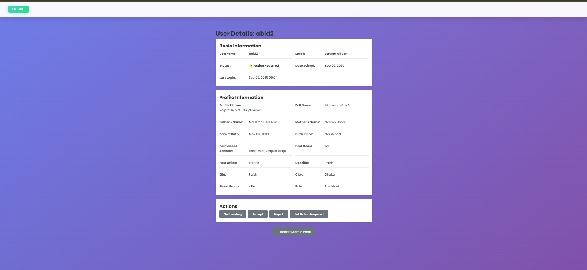
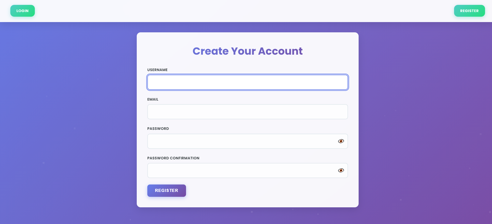
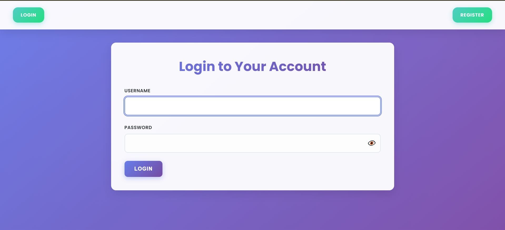
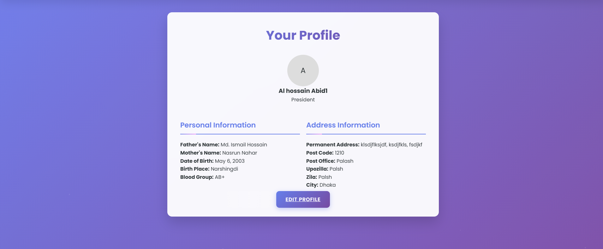

# True Hub ID - A User Management and Digital ID System

True Hub ID is a Django-based web application designed for organizations to manage their members and issue digital identification. It provides a comprehensive user management system with customizable profiles, an administrative approval workflow, and a clean, modern user interface.

## Project Overview

The primary purpose of True Hub ID is to provide a centralized platform for organizations to manage their members' information and issue digital identity cards. This system is particularly useful for clubs, associations, and other groups that need to maintain a directory of members and verify their status.

The key features include:
- A customizable profile system that can be adapted to the specific needs of an organization.
- An approval workflow for new members, ensuring that only authorized individuals are granted access.
- A digital ID card that can be accessed from the user's profile page.
- Role-based access control, with different permissions for members, chairmen, and presidents.


## Core Features

### User Management
- **User Registration:** Members can register for an account.
- **Login/Logout:** Secure user authentication.
- **Profile Management:** Users can create and edit their profiles, including uploading a profile picture.

### Customizable Profiles
- **Dynamic Fields:** Administrators can create custom fields for user profiles (e.g., text, date, select menus). This allows the organization to gather specific information from its members.
- **Flexible Data Storage:** Profile data is stored in a flexible and scalable way.

### Administrative Workflow
- **Admin Panel:** A dedicated panel for administrators to review and manage users.
- **User Approval System:** Administrators can approve, reject, or mark user profiles as pending. This ensures that only authorized members are part of the system.
- **Status Tracking:** Users and administrators can easily see the status of a profile (Action Required, Pending, Accepted, Rejected).

### Digital ID
- **Profile as a Digital ID:** The user's profile page serves as their digital identification within the organization.
- **Role Assignment:** Administrators can assign roles to users (e.g., President, Chairman, Member).

### Other Features
- **Article/News Section:** A simple content management feature to share news and articles.
- **Responsive Design:** The application is designed to work on various devices, including desktops and mobile phones.

## Screenshots

| Admin Panel | User Registration |
|---|---|
|  |  |

| User Login | User Profile |
|---|---|
|  |  |


## Technologies Used

- **Backend:** Django, Python
- **Frontend:** HTML, CSS, JavaScript
- **Database:** SQLite (for development)
- **Image Handling:** Pillow

## Installation

1.  **Clone the repository:**
    ```bash
    git clone <your-repository-url>
    cd True_Hub_Id
    ```

2.  **Create and activate a virtual environment:**
    ```bash
    python -m venv venv
    # On Windows
    venv\Scripts\activate
    # On macOS/Linux
    source venv/bin/activate
    ```

3.  **Install the dependencies:**
    ```bash
    pip install -r requirements.txt
    ```

4.  **Apply the database migrations:**
    ```bash
    python manage.py migrate
    ```

5.  **Create a superuser to access the admin panel:**
    ```bash
    python manage.py createsuperuser
    ```

6.  **Run the development server:**
    ```bash
    python manage.py runserver
    ```

7.  Open your browser and navigate to `http://127.0.0.1:8000/`.

## Usage

1.  **Register a new user.**
2.  **Log in with your credentials.**
3.  **Complete your profile information.**
4.  **Wait for an administrator to approve your profile.**
5.  **Access the admin panel at `/admin/` with your superuser account to manage users and profile fields.**

## License

This project is licensed under the MIT License.